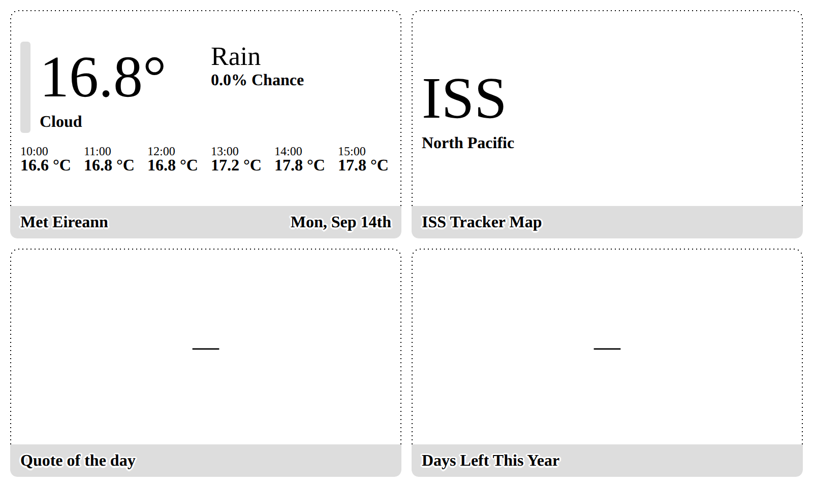
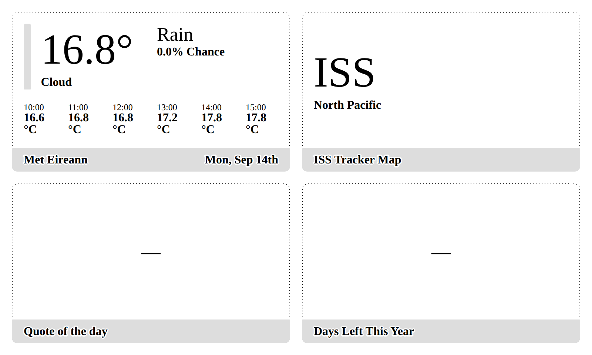

# Why this plugin broke the plugin next to it

Notes from investigating a report that the ISS Tracker Map, placed in a 4x4
mashup, changed the layout of an unrelated weather plugin.

## Why scope is the only defence

A mashup renders every plugin into **one HTML document**. There is no iframe
and no shadow root, so a plugin's `<style>` block is a document-wide stylesheet
and its `<script>` can see every other plugin's DOM.

Specificity does not save you either. The framework ships entirely inside CSS
layers:

```css
@layer tn--normalize, tn--elements, tn--components, tn--base, tn--device-overrides, tn--themes, tn--utilities;
```

All but ~21KB of the 18.6MB stylesheet sits inside those layers. **Unlayered
CSS beats layered CSS regardless of specificity**, and a plugin's `<style>`
block is unlayered. So a bare `*` in a plugin outranks the framework's own
multi-class rules. Measured:

| Plugin rule (unlayered) | Framework rule (layered) | Winner |
| --- | --- | --- |
| `*{padding:0}` | `.view--quadrant .layout{padding:var(--gap)}` | **the plugin** — neighbour's padding 10px → 0 |
| `.layout{padding:16px}` | `.view--quadrant .layout{padding:var(--gap)}` | **the plugin** — neighbour's padding 10px → 16px |
| `*{font-family:system-ui}` | `.value{font-family:var(--value-font-family)}` | **the plugin** — neighbour's font → system-ui |

This is why "my selector is less specific than theirs, so it is fine" is not a
safe assumption anywhere in a TRMNL plugin.

## The cause

`quadrant.liquid` is the view a 2x2 / 4-up mashup renders, so it is the file
the customer actually saw. Its first two rules were:

```css
:root{ --border:#000; }
*{font-family:system-ui,-apple-system,"Segoe UI",Roboto,sans-serif; margin:0; padding:0; box-sizing:border-box;}
```

That `*` did two separate kinds of damage to every plugin on screen.

**The font swap** replaced TRMNL's pixel fonts with a proportional system font.
system-ui is wider at the same nominal size, so a neighbour's text that was
tuned to fit its column no longer fit.

**The reset** set `margin:0; padding:0` on every element in the document,
stripping the framework's own spacing from the other plugins.

Measured against the real framework CSS, in a stock weather quadrant with a
six-hour strip:

| | `.layout` padding | title bar padding | font | column | `16.6 °C` |
| --- | --- | --- | --- | --- | --- |
| control | 10px | `0px 10px` | TRMNL16 | 52.5px | one line |
| `*{font-family:…}` alone | 10px | `0px 10px` | system-ui | 52.5px | **wraps** |
| `*{margin:0;padding:0}` alone | **0px** | **0px** | TRMNL16 | 55.8px | one line |
| the real quadrant block | **0px** | **0px** | **system-ui** | 55.8px | **wraps** |
| after the fix | 10px | `0px 10px` | TRMNL16 | 52.5px | one line |





The weather plugin's own code never changed.

`:root{--border:#000}` turned out to be harmless: the framework uses
`--border-token-*` and `--border-*` but never bare `--border`. It is scoped now
regardless, because relying on nobody else picking the same name is not a
strategy.

### The full and half_horizontal views

Those two files are identical to each other and carry a larger style block with
sixteen escaping rules. Four were framework classes redefined for the whole
screen — `.layout`, `.value`, `.label` and `.pill .label` — which every plugin
in a mashup has. `.craft img` restyled every image on screen, `.pill--inverted`
fired `!important` from an unscoped selector, and `.screen--half-h` invented a
member of the framework's screen-modifier namespace.

`.row` and `.map` are framework class names that were in use for this plugin's
own elements, so the framework's rules for them were landing here too, in the
other direction. In the compact views `.map` was worse than useless: the map
div carried only an id, so the rule never matched this plugin at all and
existed purely to style other plugins' `.map` elements.

### The script was worse than the CSS

```js
const root = document.querySelector('.layout');
root.classList.toggle('mode--location-only', isSmall);
```

`document.querySelector` returns the first match **in the whole mashup**.
Verified in a two-plugin mashup with the weather plugin first: `root` resolved
to the *weather* plugin's layout and the script wrote a class onto it. The ISS
plugin's own layout never got the class, so its responsive mode silently did
nothing. `fitTextToContainer` measured the neighbour's `.locwrap` for the same
reason.

The `getElementById` lookups and `L.map('map')` had a related problem: ids must
be unique per document, so two instances of this plugin in one mashup would
both bind to the first one's elements.

## The fix

Every selector is a descendant of `.iss`, every class this plugin owns is
prefixed `iss-`, and every DOM lookup goes through a root resolved from
`document.currentScript` rather than through `document`.

Verified: with the fixed quadrant block, a stock weather quadrant renders
identically to the control on padding, title bar, font, column width and line
count; across four markup shapes (`.value`, a bare `<span>`, `.label`, and
`.value` with a child `.unit`); and the class toggle lands on the ISS layout
with the neighbour untouched.

## What we checked and ruled out

The first hypothesis was that `:root` custom properties were bleeding. Worth
recording that this is mostly **not** true, because it is the obvious theory
and it is wrong.

The framework redefines most of its variables on `.trmnl .screen` and on the
per-device `.screen--<device>` class. Those are nearer ancestors than `<html>`,
so they win by proximity and a plugin's `:root` override is silently discarded:

| Declaration in a plugin's `<style>` | Reaches other plugins? |
| --- | --- |
| `:root { --gap: 16px }` | No — shadowed by `.trmnl .screen` |
| `:root { --gap-scale: 1.6 }` | No — shadowed per device |
| `:root { --content-scale: 1.6 }` | No — shadowed by `.trmnl .screen` |
| `:root { --border: #000 }` | No — the framework never reads bare `--border` |
| `:root { --framework-layout-whitespace-factor: 1.6 }` | **Yes** |
| `:root { --modifier-scale: 1.6 }` | **Yes** |
| `.screen { --gap: 16px }` | **Yes** |

Variable inheritance is the one place proximity still protects you. It does not
extend to ordinary declarations, which is what the layer table above is about.

`npm run audit:vars` regenerates this against the current framework. The
variables that do leak are the ones with nothing nearer to shadow them: the six
`--framework-layout-*` hooks, which are referenced as `var(--x, fallback)` and
never defined, plus `--modifier-scale` and `--modifier-text-scale`, which are
shadowed only when the user has a `.screen--scale-*` modifier selected. That
last detail means a leak through those two is **user-dependent** — the same
mashup can render correctly for one user and incorrectly for another.

## The rule

A selector is safe when your namespace class appears on the subject compound,
or on an ancestor of it reachable through descendant/child combinators only.

```css
.iss .layout          /* OK   subject is a descendant of .iss */
.iss.layout           /* OK   subject is itself .iss */
.layout               /* LEAK matches every plugin's layout */
:root                 /* LEAK matches <html> */
*                     /* LEAK matches everything, and outranks the framework */
.iss ~ .layout        /* LEAK a sibling of .iss is outside .iss */
.a:not(.iss) .layout  /* LEAK the namespace only appears inside :not() */
```

### Checklist

- Custom properties go on `.iss`, never `:root`, `html`, `body` or `.screen`.
- Never write `*`, and never a bare type selector (`img`, `p`, `svg`). A reset
  belongs on `.iss, .iss *`.
- Never write a bare framework class: `.layout`, `.columns`, `.item`,
  `.value`, `.label`, `.row`, `.map`, `.title_bar`, `.view`, `.screen`.
  Do not use those names for your own elements either — the framework styles
  them and that lands on you.
- Prefix `@keyframes` and `@font-face` names; those are global.
- Use classes, not ids, and resolve your root from `document.currentScript`
  before querying.
- Do not reason from specificity. The framework is layered and you are not.

`npm run lint` enforces the selector rules and exits non-zero on a violation.

## Framework-first styling

Separately from the scoping fix, most of the chrome was rebuilt on framework
utilities. Custom CSS dropped from 66 declarations to 31 in the compact views
and from 145 to 49 in `full` / `half_horizontal`.

| Was | Now |
| --- | --- |
| `position:absolute; left:8px; right:8px; bottom:8px` | `absolute left--2 right--2 bottom--2` |
| `z-index:1000` | `z--3` |
| `background:#fff` / `#000` | `bg--white` / `bg--black` |
| `border-radius:12px` | `rounded--medium` |
| `padding:8px 10px` | `p--2` |
| `display:flex; align-items:center; justify-content:center` | `flex flex--center` |
| `font-weight:800; font-size:18px` | `value value--xxsmall` |
| `color:#222` on KPI labels | `label--gray` |
| `border-left:2px solid #fff` | `border--v-white` |
| `text-align:center` | `text--center` |
| `width:100%` | `w--full` |
| `*{box-sizing:border-box}` | already in `@layer tn--normalize` — deleted |

Two things this buys beyond less code. The spacing utilities are
`calc(8px * var(--content-scale))`, so they follow the user's scale setting
where the old hardcoded pixels did not. And deleting
`*{font-family:system-ui,…}` returns the plugin to TRMNL16, a pixel font built
for 1-bit e-ink, where system-ui is antialiased for LCD.

### What stayed custom, and why

- **The pill's box border.** `border--h-*` and `border--v-*` are single-edge
  pseudo-elements; there is no four-sided border utility.
- **`translate(-50%,-50%)` icon centring** and `filter:brightness(0)`.
- **`text-overflow:ellipsis`** — no truncation utility.
- **The 53/47 location/KPI split.** `basis--*` is a pixel scale, not
  percentages, so this stays flex shorthand.
- **The 3px rounded KPI bar.** `divider--v` exists but is a themed 1px line,
  which is a different look; kept as a pseudo-element to leave the design
  unchanged.
- **`text-transform:uppercase`** on event text — `.label` leaves
  `text-transform` at `none` unless the theme sets it.
- **The Leaflet rules**, seven of them. These disappear entirely if the plugin
  moves to the framework's own Map component (MapLibre-backed, documented in
  3.3), which would also retire the CARTO key currently embedded in the
  published markup.

### What the framework does not provide

No text-fitting utility, so `fitTextToContainer`'s binary search stays. There
is a `data-clamp` system in `plugins.js`, but it trims lines rather than
scaling font size to fit. The fit function sets an inline `font-size`, which
outranks the `value--*` class on the same element.

## The framework Map component

On the `framework-maps` branch the plugin drops Leaflet for the framework's own
Map component. Custom CSS across all four views falls from 160 declarations to
94; the compact views go from 31 to 14.

```js
TRMNLMaps.watch(mapEl, () => new maplibregl.Map(TRMNLMaps.options({
  el: mapEl, preset: 'outline',
  center: [lon, lat],          // [lng, lat], the opposite order to Leaflet
  zoom: 2, labels: 'major'
})));
```

```html
<div class="layout layout--col iss">
  <div class="iss-map map stretch w--full">
    <div class="map__fallback flex flex--center h--full">…</div>
  </div>
```

`stretch` is required — without it the container collapses and the canvas
renders at the wrong height.

### What the runtime takes over

- **Tiles.** `https://maps.trmnl.com/tiles/osm/{z}/{x}/{y}`, no key. This
  retires the CARTO key that was embedded in the published markup of all four
  views.
- **Attribution.** `attach()` writes the OSM credit into the container, so the
  hand-rolled `.iss-attrib` element is gone.
- **Dithering.** Vector tiles painted per device and bit depth, rather than
  raster tiles run through a CSS filter.
- **Readiness.** `terminalize` awaits every attached map through
  `TRMNLMaps.settle()` before capture. The Leaflet version raced a
  `setTimeout(… , 60)`.
- **Rebuilds.** `watch()` rebuilds on device, scale, mode and theme changes.
- **No WebGL.** The container is flagged `data-map-unsupported`, the builder is
  never called and `.map__fallback` shows. There was no fallback before.

### What stays

The ISS icon is still a rotated PNG overlay centred on the map — `dot()` draws a
themed disc and cannot place custom artwork. Since the camera centres on the
station, a centred overlay still lands in the right place.

One rule had to be added back: `attach()` places the credit at the container's
bottom-right, where the compact views' pill covers it. TRMNL requires it to
stay visible, so `.iss .map__attribution{ bottom:52px }` lifts it clear.

### Verified, and not

Rendered against the published framework CSS and JS with real vector tiles, in
both calm and event modes, at each view's real geometry. The neighbouring
weather quadrant still matches the control.

Not verified from here: that the account's framework version exposes
`TRMNLMaps` (the Map component is documented in 3.3, not 3.1), that
`maps.trmnl.com` is reachable from TRMNL's own renderer, and how the dithered
vector map reads on a real panel. The sandbox proxy's CA is not in headless
Chromium's trust store, so tiles were pre-fetched with curl and served locally;
the plugin itself carries no such override.
